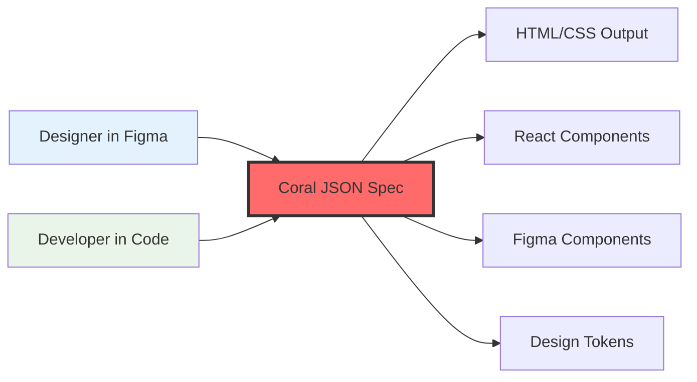
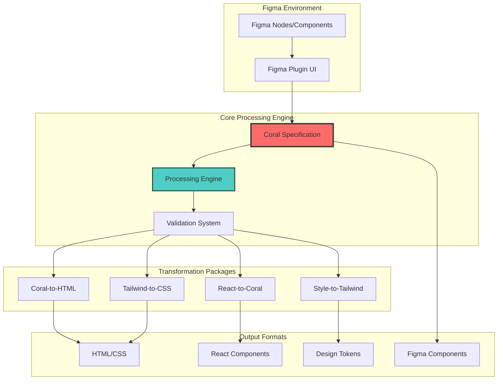
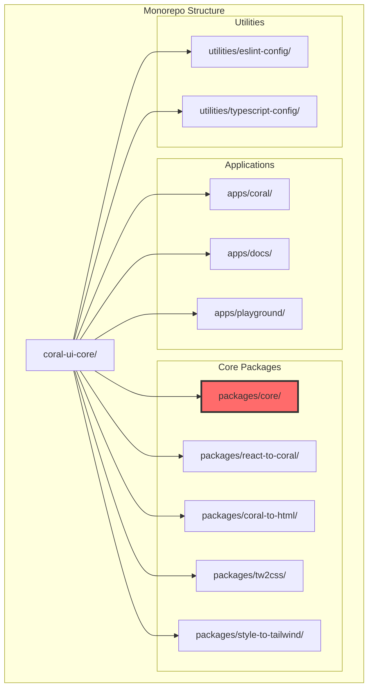
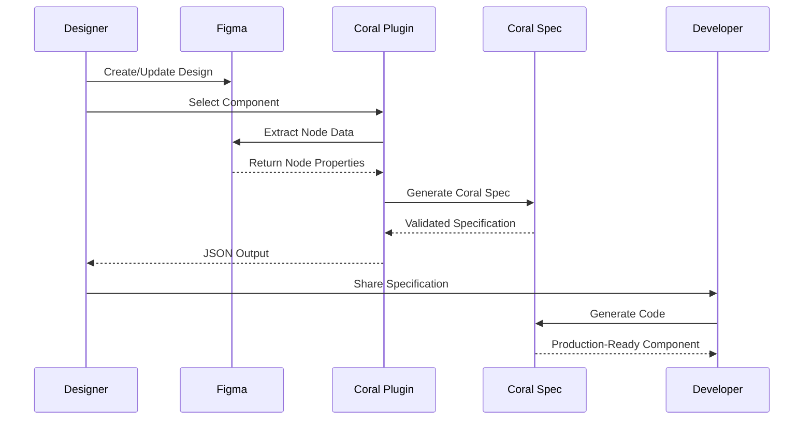
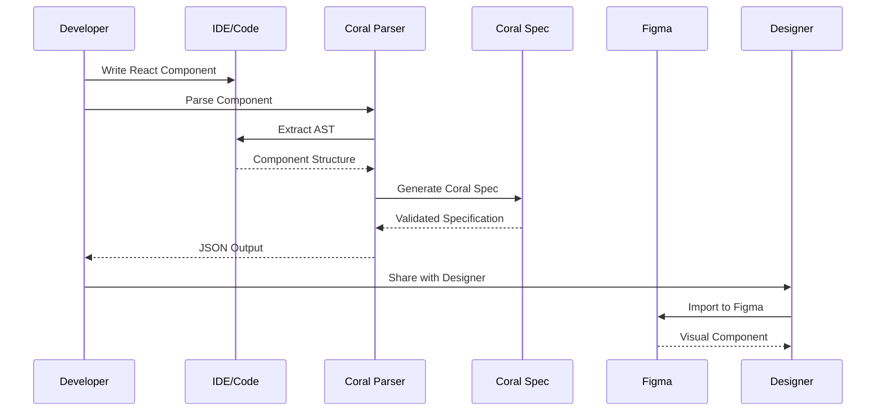
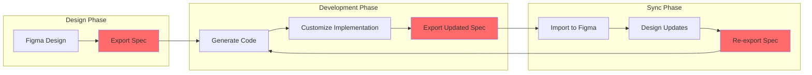
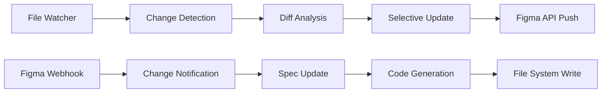

# Coral UI System - Comprehensive Documentation

> **A revolutionary bi-directional design-to-code platform bridging Figma and development workflows**

## Table of Contents

1. [System Overview](#system-overview)
2. [Architecture Deep Dive](#architecture-deep-dive)
3. [Current Features](#current-features)
4. [User Workflows](#user-workflows)
5. [Technical Implementation](#technical-implementation)
6. [Missing Features & Opportunities](#missing-features--opportunities)
7. [Roadmap & Strategic Recommendations](#roadmap--strategic-recommendations)
8. [Technical Specifications](#technical-specifications)

---

## System Overview

Coral UI is an innovative toolkit that enables seamless bi-directional transformation between design and code. It creates a unified specification format that serves as the single source of truth for UI components across different platforms and tools.

### Core Value Proposition



### Key Benefits

- **Design-Code Consistency**: Eliminate drift between design and implementation
- **Developer Velocity**: Generate production-ready code from designs
- **Designer Empowerment**: Create real components without coding
- **Scalable Design Systems**: Maintain consistency across large teams
- **Cross-Platform Output**: One spec, multiple target formats

---

## Architecture Deep Dive

### System Architecture



### Package Structure



---

## Current Features

### 🎨 Figma Integration

#### Export Capabilities
- **Component Extraction**: Convert Figma components to Coral specs
- **Style Preservation**: Maintain visual properties (colors, typography, spacing)
- **Variant Support**: Handle component variants and properties
- **Design Token Generation**: Extract reusable design tokens
- **Gradient Handling**: Complex gradient transformations

#### Import Capabilities
- **JSON to Figma**: Create Figma nodes from Coral specifications
- **Layout Recreation**: Preserve layout structure and constraints
- **Component Creation**: Generate Figma components with proper naming
- **Batch Processing**: Handle multiple elements efficiently

### 🔧 Code Transformation

#### React Component Analysis
```typescript
// Input: React Component
const Button = ({ variant, children, onClick }) => {
  const [isLoading, setIsLoading] = useState(false)
  
  return (
    <button 
      className={`btn btn-${variant}`}
      onClick={onClick}
    >
      {children}
    </button>
  )
}

// Output: Coral Specification with extracted:
// - Props: variant, children, onClick
// - State: isLoading, setIsLoading  
// - Styles: className parsing
// - Component structure
```

#### HTML Generation
- **Semantic HTML**: Proper element selection based on component type
- **CSS Integration**: Style object to CSS conversion
- **Accessibility**: Proper ARIA attributes and semantic structure
- **Responsive Design**: Breakpoint and responsive style handling

#### Tailwind CSS Support
- **Class Parsing**: Convert Tailwind classes to CSS properties
- **Custom Properties**: Support for CSS custom properties
- **Responsive Utilities**: Breakpoint-aware transformations
- **Design System Integration**: Map to design tokens

### 📊 Specification System

#### Core Schema Structure
```json
{
  "$schema": "https://coral.design/schema.json",
  "name": "ComponentName",
  "elementType": "div",
  "type": "COMPONENT",
  "styles": {
    "backgroundColor": "#ff6b6b",
    "padding": "16px",
    "borderRadius": "8px"
  },
  "children": [],
  "variants": [],
  "componentProperties": {},
  "designTokens": {},
  "imports": [],
  "methods": [],
  "stateHooks": []
}
```

#### Design Token System
- **Color Tokens**: Semantic color definitions
- **Typography Tokens**: Font families, sizes, weights
- **Spacing Tokens**: Consistent spacing scale
- **Shadow Tokens**: Elevation and shadow styles
- **Border Tokens**: Border radius, width, style definitions

---

## User Workflows

### Designer Workflow



### Developer Workflow



### Bi-directional Sync Workflow



---

## Technical Implementation

### Core Processing Engine

#### Specification Parser (`packages/core/`)
```typescript
// Key functions from parseUISpec.ts
export const parseUISpec = (spec: unknown): CoralRootNode => {
  return zCoralRootSchema.parse(spec)
}

// Validation with Zod schemas ensures type safety
export const zCoralRootSchema = zCoralNodeWithChildrenSchema.and(
  z.object({
    $schema: z.literal('https://coral.design/schema.json').optional(),
    componentProperties: zCoralComponentPropertySchema.optional(),
    designTokens: z.record(zCoralNameSchema, zCoralDesignTokenSchema).optional(),
    // ... additional root-level properties
  })
)
```

#### AST Processing (`packages/react-to-coral/`)
```typescript
// React component analysis using Babel
export const transformReactComponentToSpec = (component: string) => {
  const ast = parse(component, {
    sourceType: 'module',
    plugins: ['jsx', 'typescript'],
  })
  
  const result = {
    imports: [],
    methods: [],
    stateHooks: [],
    componentProperties: []
  }
  
  // Traverse AST and extract component data
  traverse(ast, {
    FunctionDeclaration(path) {
      // Extract component function
    },
    JSXElement(path) {
      // Parse JSX elements
    },
    CallExpression(path) {
      // Extract useState, useEffect, etc.
    }
  })
  
  return result
}
```

#### Style Transformation (`packages/tw2css/`)
```typescript
// Tailwind to CSS conversion
export const tailwindToCSS = (classes: string): Record<string, string> => {
  const classArray = classes.split(' ')
  const styles: Record<string, string> = {}
  
  classArray.forEach(className => {
    const cssProperty = mapTailwindToCSS(className)
    if (cssProperty) {
      Object.assign(styles, cssProperty)
    }
  })
  
  return styles
}
```

### Figma Plugin Implementation

#### Plugin Architecture (`apps/coral/src/plugin/code.ts`)
```typescript
// Main plugin entry point
figma.showUI(__html__, { width: 600, height: 900, themeColors: true })

figma.ui.onmessage = async (msg) => {
  if (msg.type === EXPORT_SPEC) {
    const spec = await exportSpec()
    figma.ui.postMessage({ type: 'SPEC_CREATED', message: spec })
  } else if (msg.type === IMPORT_SPEC) {
    const spec = await parseUISpec(msg.message)
    const elements = await createElements(spec)
    figma.currentPage.appendChild(elements)
    figma.currentPage.selection = [elements]
    figma.viewport.scrollAndZoomIntoView([elements])
  }
}
```

#### Export Process (`apps/coral/src/plugin/lib/exportSpec.ts`)
```typescript
// Node traversal and data extraction
const traverseNodes = async (
  node: SceneNode,
  designTokens: Record<string, CoralDesignTokenType> = {}
): Promise<[CoralRootNode | CoralNode | null, Record<string, CoralDesignTokenType>]> => {
  
  let nodeData = null
  
  if (node.type === 'COMPONENT_SET') {
    nodeData = await generateComponentSet(node as ComponentSetNode)
  } else {
    nodeData = await generateNode(node as ComponentNode)
  }
  
  // Process children recursively
  if ('children' in node) {
    for (const childNode of node.children) {
      const [childData, childTokens] = await traverseNodes(childNode, designTokens)
      if (childData) {
        nodeData.children?.push(childData)
      }
      Object.assign(designTokens, childTokens)
    }
  }
  
  return [nodeData, designTokens]
}
```

---

## Missing Features & Opportunities

### 🚀 High-Impact Missing Features

#### 1. Real-time Synchronization
**Current State**: Manual export/import process
**Opportunity**: Live bidirectional sync between Figma and code



**Implementation Strategy**:
- File system watchers for code changes
- Figma plugin webhooks for design changes
- Intelligent diffing to prevent update loops
- Conflict resolution UI

#### 2. Visual Component Preview
**Current State**: JSON editor only
**Opportunity**: Live preview of components within plugin

**Features Needed**:
- Embedded React renderer in Figma plugin
- Style preview with design token mapping
- Interactive component state preview
- Responsive breakpoint preview

#### 3. Animation & Interaction Support
**Current State**: Static component export only
**Opportunity**: Capture and recreate micro-interactions

```typescript
// Proposed schema extension
interface CoralAnimationType {
  trigger: 'hover' | 'click' | 'focus' | 'scroll'
  property: string
  duration: number
  easing: string
  from: string | number
  to: string | number
}

interface CoralInteractionType {
  type: 'navigation' | 'state_change' | 'api_call'
  trigger: 'click' | 'submit' | 'change'
  action: string
  parameters?: Record<string, any>
}
```

#### 4. Design System Integration
**Current State**: Basic design token extraction
**Opportunity**: Full design system management

**Features**:
- Token versioning and migration
- Component library management  
- Style guide generation
- Brand consistency checking
- Multi-theme support

### 🎯 Medium-Impact Opportunities

#### 5. Advanced Code Generation
**Templates & Frameworks**:
- Vue.js component generation
- Angular component support
- Svelte component export
- Web Components (Custom Elements)
- React Native component generation

#### 6. Accessibility Enhancement
**Current State**: Basic semantic HTML
**Opportunity**: Comprehensive a11y support

```typescript
interface CoralAccessibilityType {
  role?: string
  ariaLabel?: string
  ariaDescribedBy?: string
  tabIndex?: number
  keyboardNavigation?: {
    focusable: boolean
    shortcuts: Record<string, string>
  }
  screenReader?: {
    announcements: string[]
    liveRegion?: 'polite' | 'assertive'
  }
}
```

#### 7. Version Control Integration
**Git Integration**:
- Component change tracking
- Design/code diff visualization
- Merge conflict resolution for specs
- Automated PR creation for design changes

#### 8. Advanced Styling Features
**CSS-in-JS Support**:
- Styled-components generation
- Emotion CSS generation
- Theme provider integration
- Dynamic styling based on props

### 🔧 Technical Infrastructure Improvements

#### 9. Performance Optimization
**Current Issues**:
- Artificial delays in import process (`await wait(100)`)
- Synchronous processing of large component trees
- No caching for repeated transformations

**Opportunities**:
- Parallel processing with Web Workers
- Incremental parsing and caching
- Smart dependency analysis
- Bundle optimization

#### 10. Developer Experience
**CLI Tool**:
```bash
# Proposed CLI commands
coral init project-name
coral watch --src ./components --output ./coral-specs
coral generate --spec button.coral.json --framework react
coral sync --figma-file FILE_ID --local ./specs
coral validate ./specs/**/*.coral.json
```

#### 11. Testing Infrastructure
**Automated Testing**:
- Visual regression testing integration
- Component snapshot testing
- Cross-browser compatibility testing
- Performance benchmarking

### 🌟 Innovation Opportunities

#### 12. AI-Powered Features
**Smart Component Recognition**:
- Auto-categorization of components
- Pattern detection and suggestion
- Code optimization recommendations
- Design consistency analysis

#### 13. Plugin Ecosystem
**Third-party Extensions**:
- Custom transformation plugins
- Framework-specific generators
- Design system integrations
- Workflow automation tools

#### 14. Collaborative Features
**Team Workflows**:
- Component approval workflows
- Change request system
- Team-wide component library
- Usage analytics and tracking

---

## Roadmap & Strategic Recommendations

### Phase 1: Foundation Strengthening (Months 1-2)

#### Critical Performance Fixes
```mermaid
gantt
    title Phase 1 - Foundation
    dateFormat X
    axisFormat %d
    
    section Performance
    Remove artificial delays    :done, perf1, 0, 3d
    Implement parallel processing :active, perf2, 3d, 7d
    Add transformation caching   :perf3, 7d, 14d
    
    section Testing
    Unit test coverage          :test1, 0, 10d
    Integration test suite      :test2, 10d, 14d
    
    section UX
    Error handling improvement  :ux1, 0, 7d
    Loading states and feedback :ux2, 7d, 14d
```

**Priorities**:
1. **Performance Optimization**: Remove `await wait(100)` delays, implement efficient batching
2. **Error Handling**: Comprehensive error states with user-friendly messages
3. **Test Coverage**: Critical path testing for all transformation functions
4. **Documentation**: API documentation and usage examples

### Phase 2: Core Feature Expansion (Months 3-4)

```mermaid
gantt
    title Phase 2 - Feature Expansion
    dateFormat X
    axisFormat %d
    
    section Preview
    Component preview UI        :prev1, 0, 14d
    Interactive state preview   :prev2, 14d, 21d
    
    section Generation
    Vue.js support             :gen1, 0, 10d
    Angular support            :gen2, 10d, 20d
    Web Components             :gen3, 20d, 28d
    
    section Accessibility
    A11y schema extension      :a11y1, 0, 7d
    Automated a11y checking    :a11y2, 7d, 21d
```

**Key Features**:
1. **Visual Preview System**: Live component preview within Figma plugin
2. **Multi-Framework Support**: Vue, Angular, Web Components generation
3. **Accessibility Integration**: Comprehensive a11y support in specifications
4. **Advanced Styling**: CSS-in-JS and modern styling solutions

### Phase 3: Advanced Integration (Months 5-6)

```mermaid
gantt
    title Phase 3 - Advanced Integration  
    dateFormat X
    axisFormat %d
    
    section Sync
    Real-time sync architecture :sync1, 0, 21d
    Conflict resolution system  :sync2, 21d, 28d
    
    section Design System
    Token versioning system     :ds1, 0, 14d
    Component library mgmt      :ds2, 14d, 28d
    
    section DevEx
    CLI tool development        :cli1, 0, 21d
    VS Code extension          :vsc1, 21d, 28d
```

**Advanced Capabilities**:
1. **Real-time Synchronization**: Bidirectional live sync between design and code
2. **Design System Management**: Complete design system lifecycle management
3. **Developer Tooling**: CLI tools and IDE integrations
4. **Animation Support**: Micro-interaction capture and recreation

### Phase 4: Platform & Ecosystem (Months 7-12)

**Vision**:
- Plugin marketplace for custom transformations
- AI-powered component optimization
- Enterprise team management features
- Integration with major design systems (Material, Ant Design, Chakra UI)

---

## Technical Specifications

### System Requirements

#### Development Environment
- **Node.js**: ≥20.12.0
- **Package Manager**: pnpm 9.1.0
- **TypeScript**: ^5.5.4
- **Build Tools**: Vite, ESBuild, Turbo

#### Dependencies Overview
```json
{
  "core": {
    "zod": "Specification validation",
    "colord": "Color manipulation", 
    "node-html-parser": "HTML parsing"
  },
  "figma-plugin": {
    "@figma/plugin-typings": "Figma API types",
    "@uiw/react-codemirror": "Code editor",
    "zustand": "State management"
  },
  "transformations": {
    "@babel/parser": "JavaScript/TypeScript AST parsing",
    "@babel/traverse": "AST traversal",
    "prettier": "Code formatting"
  }
}
```

### Performance Benchmarks

#### Current Performance (as of audit)
- **Small Component Export**: ~500ms (with artificial delays)
- **Medium Component Tree**: ~2-3 seconds
- **Large Component Set**: ~10+ seconds

#### Target Performance Goals
- **Small Component Export**: <100ms  
- **Medium Component Tree**: <500ms
- **Large Component Set**: <2 seconds
- **Real-time Sync Latency**: <200ms

### Security Considerations

#### Data Handling
- All processing happens locally (no external API calls)
- Figma plugin runs in sandboxed environment
- No sensitive data persistence beyond user session

#### Code Generation Safety
- Input validation through Zod schemas
- AST parsing prevents code injection
- Generated code is statically analyzable

---

## Getting Started

### Installation

```bash
# Clone the repository
git clone https://github.com/reallygoodwork/coral-ui-core.git
cd coral-ui-core

# Install dependencies
pnpm install

# Build all packages
pnpm build

# Start development
pnpm dev
```

### Basic Usage

#### 1. Export from Figma
1. Install the Coral UI Figma plugin
2. Select a component in Figma
3. Click "Export to Spec" in the plugin
4. Copy the generated JSON specification

#### 2. Generate Code
```typescript
import { parseUISpec } from '@reallygoodwork/coral-core'
import { coralToHTML } from '@reallygoodwork/coral-to-html'

const spec = parseUISpec(jsonSpec)
const html = await coralToHTML(spec)
console.log(html)
```

#### 3. Import to Figma
1. Paste your Coral JSON specification into the plugin
2. Click "Import to Figma"
3. The component will be created on your current page

---

## Conclusion

Coral UI represents a significant step forward in bridging the design-development gap. With its robust architecture, comprehensive feature set, and clear roadmap for expansion, it has the potential to become an essential tool for modern design systems and development workflows.

The system's modular architecture provides excellent foundations for the proposed enhancements, and the identified opportunities could transform how teams collaborate between design and development phases.

**Next Steps**:
1. Implement Phase 1 performance improvements
2. Establish comprehensive testing coverage  
3. Begin development of real-time synchronization features
4. Engage with the community for feedback and feature prioritization

The future of design-to-code automation is bright, and Coral UI is well-positioned to lead this transformation.