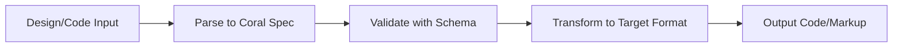

import { Card, CardGrid, Aside } from '@astrojs/starlight/components'

Understanding these core concepts will help you make the most of Coral UI's powerful transformation capabilities.

## The Coral Philosophy

Coral UI is built on the principle that **UI components should be describable in a universal, framework-agnostic format**. This enables:

- **Seamless transformations** between different technologies
- **Design system consistency** across platforms
- **Automated code generation** from design tools
- **Component reusability** across projects

## Core Concepts

<CardGrid>
  <Card title="🪸 Coral Specification" icon="star">
    A JSON-based format that describes UI components in a universal way
    
    [Learn more →](/concepts/coral-spec/)
  </Card>
  <Card title="🔄 Transformations" icon="rocket">
    Convert between different UI representations (React, HTML, CSS, etc.)
    
    [Learn more →](/concepts/transformations/)
  </Card>
  <Card title="📋 JSON Schemas" icon="setting">
    Validation and type safety for all component specifications
    
    [Learn more →](/concepts/schemas/)
  </Card>
  <Card title="🎨 Design Tokens" icon="palette">
    Standardized approach to design system values and styling
    
    [Learn more →](/concepts/design-tokens/)
  </Card>
</CardGrid>

## The Transformation Pipeline

Coral UI's transformation pipeline follows a predictable flow:



### Input Sources

Coral UI can accept input from multiple sources:

- **HTML markup** with CSS classes
- **React components** with JSX
- **Design tokens** in JSON format
- **Figma designs** via plugin
- **Manual specifications** in JSON

### Output Targets

Transform to various output formats:

- **HTML** with inline or external CSS
- **React components** with TypeScript
- **CSS objects** for styling libraries
- **Design tokens** in multiple formats
- **JSON specifications** for further processing

## Key Principles

### 1. Framework Agnostic

Coral UI doesn't favor any particular framework. The Coral specification is designed to be equally useful whether you're working with React, Vue, Angular, or plain HTML.

```typescript
// Same spec can generate different outputs
const spec = {
  elementType: 'button',
  name: 'PrimaryButton',
  styles: { backgroundColor: '#3b82f6' },
  children: ['Click me']
}

// → React: <PrimaryButton>Click me</PrimaryButton>
// → HTML: <button style="background-color: #3b82f6">Click me</button>
// → Vue: <PrimaryButton>Click me</PrimaryButton>
```

### 2. Composable Architecture

Components are built from smaller, reusable pieces that can be combined in flexible ways.

```typescript
const iconButton = {
  elementType: 'button',
  children: [
    { elementType: 'Icon', props: { name: 'search' } },
    { elementType: 'span', children: ['Search'] }
  ]
}
```

### 3. Type Safety

All specifications are validated against JSON schemas, ensuring consistency and catching errors early.

```typescript
import { parseUISpec } from '@reallygoodwork/coral-core'

// This will throw if the spec is invalid
const validSpec = parseUISpec(userSpec)
```

### 4. Extensibility

The system is designed to be extended with custom transformations, schemas, and output formats.

## Data Flow

Understanding how data flows through Coral UI helps you use it more effectively:

### 1. Input Processing

```typescript
// Raw input (HTML, React, etc.)
const input = '<button class="btn-primary">Click me</button>'

// Parse to intermediate representation
const ast = parseInput(input)

// Extract semantic information
const semantics = extractSemantics(ast)
```

### 2. Specification Generation

```typescript
// Combine information into Coral spec
const coralSpec = {
  elementType: 'button',
  styles: extractedStyles,
  attributes: extractedAttributes,
  children: extractedContent
}

// Validate against schema
const validatedSpec = validateSpec(coralSpec)
```

### 3. Output Generation

```typescript
// Transform to target format
const output = transformSpec(validatedSpec, targetFormat)

// Apply formatting and optimization
const finalOutput = formatOutput(output)
```

## Working with Complex Components

### Component Hierarchy

Coral UI handles nested component structures naturally:

```typescript
const cardComponent = {
  elementType: 'div',
  name: 'Card',
  children: [
    {
      elementType: 'div',
      name: 'CardHeader',
      children: [
        { elementType: 'h2', children: ['Title'] }
      ]
    },
    {
      elementType: 'div',
      name: 'CardBody',
      children: [
        { elementType: 'p', children: ['Content'] }
      ]
    }
  ]
}
```

### State and Interactivity

Components can include state management and event handling:

```typescript
const interactiveComponent = {
  elementType: 'div',
  name: 'Counter',
  state: [
    { name: 'count', type: 'number', defaultValue: 0 }
  ],
  methods: [
    { name: 'increment', returnType: 'void' }
  ],
  children: [
    { elementType: 'span', children: ['Count: {count}'] },
    { 
      elementType: 'button', 
      attributes: { onClick: 'increment' },
      children: ['+']
    }
  ]
}
```

## Best Practices

<Aside type="tip" title="Naming Conventions">
Use consistent naming for components and properties:
- **PascalCase** for component names
- **camelCase** for properties and methods
- **kebab-case** for HTML attributes
</Aside>

<Aside type="note" title="Performance Considerations">
- Validate specs during development, not runtime
- Cache parsed specifications when possible
- Use tree-shaking to include only needed functions
</Aside>

### Recommended Workflow

1. **Start with existing code** - Use `transformHTMLToSpec()` or similar functions
2. **Validate early** - Always use `parseUISpec()` to catch issues
3. **Iterate incrementally** - Add complexity gradually
4. **Test transformations** - Verify output matches expectations
5. **Document specifications** - Keep specs readable and maintainable

## Common Patterns

### Design System Integration

```typescript
// Define design tokens
const tokens = {
  colors: {
    primary: '#3b82f6',
    secondary: '#6b7280'
  },
  spacing: {
    sm: '8px',
    md: '16px',
    lg: '24px'
  }
}

// Use in components
const button = {
  elementType: 'button',
  styles: {
    backgroundColor: tokens.colors.primary,
    padding: `${tokens.spacing.sm} ${tokens.spacing.md}`
  }
}
```

### Responsive Design

```typescript
const responsiveCard = {
  elementType: 'div',
  name: 'ResponsiveCard',
  styles: {
    width: '100%',
    maxWidth: '400px',
    '@media (min-width: 768px)': {
      maxWidth: '600px'
    }
  }
}
```

## Next Steps

Now that you understand the core concepts, dive deeper into specific areas:

- [Coral Specification Format](/concepts/coral-spec/) - Detailed spec structure
- [Transformation Pipeline](/concepts/transformations/) - How conversions work
- [Schema Validation](/concepts/schemas/) - Ensuring spec correctness
- [Package Documentation](/packages/core/) - Using specific packages