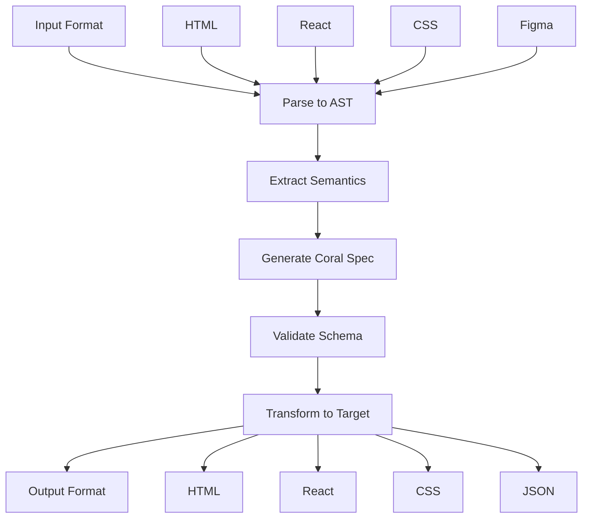

import { Card, CardGrid, Tabs, TabItem, Badge, Aside } from '@astrojs/starlight/components'

Coral UI's transformation pipeline is the engine that converts between different UI representations. This system enables seamless conversion between HTML, React components, CSS frameworks, and the universal Coral specification format.

## Overview

The transformation pipeline follows a predictable flow:



## Core Transformation Types

### 1. HTML to Coral Specification

Convert existing HTML markup into Coral specifications.

**Function:** `transformHTMLToSpec(html: string): CoralRootNode`

**Process:**
1. **Parse HTML** - Convert HTML string to DOM tree
2. **Extract structure** - Map DOM nodes to Coral elements
3. **Process styles** - Convert CSS classes and inline styles
4. **Handle attributes** - Map HTML attributes to element properties
5. **Generate specification** - Create valid Coral spec

**Example:**

<Tabs>
  <TabItem label="Input HTML">
    ```html
    <div class="card bg-white p-6 rounded-lg shadow-md">
      <h2 class="text-xl font-bold mb-4">Product Name</h2>
      <p class="text-gray-600 mb-4">Product description goes here.</p>
      <button class="bg-blue-500 text-white px-4 py-2 rounded hover:bg-blue-600">
        Buy Now
      </button>
    </div>
    ```
  </TabItem>
  <TabItem label="Generated Coral Spec">
    ```json
    {
      "elementType": "div",
      "name": "Card",
      "elementAttributes": {
        "class": ["card", "bg-white", "p-6", "rounded-lg", "shadow-md"]
      },
      "children": [
        {
          "elementType": "h2",
          "name": "ProductName",
          "elementAttributes": {
            "class": ["text-xl", "font-bold", "mb-4"]
          },
          "children": ["Product Name"]
        },
        {
          "elementType": "p",
          "name": "ProductDescription",
          "elementAttributes": {
            "class": ["text-gray-600", "mb-4"]
          },
          "children": ["Product description goes here."]
        },
        {
          "elementType": "button",
          "name": "BuyButton",
          "elementAttributes": {
            "class": ["bg-blue-500", "text-white", "px-4", "py-2", "rounded", "hover:bg-blue-600"]
          },
          "children": ["Buy Now"]
        }
      ]
    }
    ```
  </TabItem>
</Tabs>

**Advanced HTML Processing:**

```typescript
import { transformHTMLToSpec } from '@reallygoodwork/coral-core'

// Complex HTML with nested structures
const complexHTML = `
<article class="blog-post max-w-4xl mx-auto">
  <header class="mb-8">
    <h1 class="text-3xl font-bold text-gray-900">Article Title</h1>
    <div class="flex items-center mt-4 text-sm text-gray-500">
      <time datetime="2024-01-15">January 15, 2024</time>
      <span class="mx-2">•</span>
      <span>5 min read</span>
    </div>
  </header>
  
  <div class="prose prose-lg">
    <p class="lead">This is the article introduction paragraph.</p>
    <p>Regular paragraph content with <strong>bold text</strong> and <em>italic text</em>.</p>
    
    <blockquote class="border-l-4 border-blue-500 pl-4 italic">
      "This is an important quote from the article."
    </blockquote>
    
    <ul class="list-disc list-inside">
      <li>First list item</li>
      <li>Second list item</li>
      <li>Third list item</li>
    </ul>
  </div>
</article>
`

const articleSpec = transformHTMLToSpec(complexHTML)
console.log('Generated article spec:', articleSpec)
```

### 2. React Component to Coral Specification

Parse React component source code into Coral specifications.

**Function:** `transformReactComponentToSpec(source: string): CoralRootNode`

**Process:**
1. **Parse JSX** - Convert React source to AST
2. **Extract component structure** - Identify component definition
3. **Analyze props** - Extract TypeScript interfaces and prop types
4. **Process state** - Identify useState, useEffect, and other hooks
5. **Map JSX elements** - Convert JSX to Coral element hierarchy
6. **Extract methods** - Identify event handlers and functions

**Example:**

<Tabs>
  <TabItem label="React Component">
    ```typescript
    import React, { useState } from 'react'

    interface ButtonProps {
      variant?: 'primary' | 'secondary'
      size?: 'small' | 'medium' | 'large'
      disabled?: boolean
      children: React.ReactNode
      onClick?: () => void
    }

    export function Button({ 
      variant = 'primary', 
      size = 'medium', 
      disabled = false,
      children, 
      onClick 
    }: ButtonProps) {
      const [isPressed, setIsPressed] = useState(false)
      
      const handleMouseDown = () => setIsPressed(true)
      const handleMouseUp = () => setIsPressed(false)
      
      const baseClasses = 'font-medium rounded focus:outline-none transition-colors'
      const variantClasses = {
        primary: 'bg-blue-500 hover:bg-blue-600 text-white',
        secondary: 'bg-gray-200 hover:bg-gray-300 text-gray-800'
      }
      const sizeClasses = {
        small: 'px-3 py-1 text-sm',
        medium: 'px-4 py-2',
        large: 'px-6 py-3 text-lg'
      }
      
      return (
        <button
          className={`${baseClasses} ${variantClasses[variant]} ${sizeClasses[size]}`}
          disabled={disabled}
          onClick={onClick}
          onMouseDown={handleMouseDown}
          onMouseUp={handleMouseUp}
        >
          {children}
        </button>
      )
    }
    ```
  </TabItem>
  <TabItem label="Generated Coral Spec">
    ```json
    {
      "elementType": "button",
      "name": "Button",
      "componentName": "Button",
      
      "imports": [
        {
          "name": "React",
          "from": "react",
          "type": "default"
        },
        {
          "name": "{ useState }",
          "from": "react", 
          "type": "named"
        }
      ],
      
      "stateHooks": [
        {
          "name": "isPressed",
          "setterName": "setIsPressed",
          "initialValue": false,
          "tsType": "boolean",
          "hookType": "useState"
        }
      ],
      
      "methods": [
        {
          "name": "handleMouseDown",
          "parameters": [],
          "returnType": "void"
        },
        {
          "name": "handleMouseUp", 
          "parameters": [],
          "returnType": "void"
        }
      ],
      
      "variantProperties": {
        "variant": {
          "type": ["string"],
          "value": "primary"
        },
        "size": {
          "type": ["string"],
          "value": "medium"
        },
        "disabled": {
          "type": "boolean",
          "value": false
        }
      },
      
      "elementAttributes": {
        "className": "{computed class string}",
        "disabled": "{disabled}",
        "onClick": "{onClick}",
        "onMouseDown": "handleMouseDown",
        "onMouseUp": "handleMouseUp"
      },
      
      "children": ["{children}"]
    }
    ```
  </TabItem>
</Tabs>

### 3. Tailwind CSS to Style Objects

Convert Tailwind CSS classes to CSS property objects.

**Function:** `tailwindToCSS(classes: string): Record<string, string>`

**Process:**
1. **Parse class string** - Split classes by whitespace
2. **Map to CSS properties** - Convert each class to CSS rules
3. **Handle responsive variants** - Process `sm:`, `md:`, `lg:`, `xl:` prefixes
4. **Process pseudo-classes** - Handle `hover:`, `focus:`, `active:` states
5. **Combine properties** - Merge all CSS into a single object

**Example:**

<Tabs>
  <TabItem label="Tailwind Classes">
    ```typescript
    import { tailwindToCSS } from '@reallygoodwork/tw2css'

    const classes = `
      bg-gradient-to-r from-blue-500 to-purple-600
      text-white font-bold text-xl
      px-6 py-3 rounded-lg shadow-lg
      hover:shadow-xl hover:scale-105
      focus:outline-none focus:ring-2 focus:ring-blue-300
      transition-all duration-300 ease-in-out
      md:text-2xl lg:px-8 lg:py-4
    `

    const styles = tailwindToCSS(classes)
    ```
  </TabItem>
  <TabItem label="Generated CSS">
    ```javascript
    {
      background: 'linear-gradient(to right, #3b82f6, #8b5cf6)',
      color: '#ffffff',
      fontWeight: '700',
      fontSize: '1.25rem',
      paddingLeft: '1.5rem',
      paddingRight: '1.5rem',
      paddingTop: '0.75rem',
      paddingBottom: '0.75rem',
      borderRadius: '0.5rem',
      boxShadow: '0 10px 15px -3px rgba(0, 0, 0, 0.1), 0 4px 6px -2px rgba(0, 0, 0, 0.05)',
      transitionProperty: 'all',
      transitionDuration: '300ms',
      transitionTimingFunction: 'cubic-bezier(0.4, 0, 0.2, 1)',
      
      ':hover': {
        boxShadow: '0 25px 25px -5px rgba(0, 0, 0, 0.1), 0 10px 10px -5px rgba(0, 0, 0, 0.04)',
        transform: 'scale(1.05)'
      },
      
      ':focus': {
        outline: 'none',
        boxShadow: '0 0 0 3px rgba(59, 130, 246, 0.3)'
      },
      
      '@media (min-width: 768px)': {
        fontSize: '1.5rem'
      },
      
      '@media (min-width: 1024px)': {
        paddingLeft: '2rem',
        paddingRight: '2rem',
        paddingTop: '1rem',
        paddingBottom: '1rem'
      }
    }
    ```
  </TabItem>
</Tabs>

### 4. Coral Specification to HTML

Generate HTML markup from Coral specifications.

**Function:** `transformSpecToHTML(spec: CoralNode): string`

**Process:**
1. **Validate specification** - Ensure spec is valid
2. **Generate elements** - Create HTML elements from specs
3. **Apply styles** - Convert style objects to CSS
4. **Set attributes** - Map element attributes to HTML
5. **Render children** - Recursively process child elements
6. **Format output** - Apply consistent indentation and formatting

**Example:**

<Tabs>
  <TabItem label="Coral Specification">
    ```json
    {
      "elementType": "div",
      "name": "ProductCard",
      "styles": {
        "backgroundColor": "#ffffff",
        "borderRadius": "8px",
        "padding": "24px",
        "boxShadow": "0 4px 6px rgba(0, 0, 0, 0.1)"
      },
      "children": [
        {
          "elementType": "h3",
          "name": "ProductTitle",
          "styles": {
            "fontSize": "20px",
            "fontWeight": "600",
            "marginBottom": "12px"
          },
          "children": ["Amazing Product"]
        },
        {
          "elementType": "p",
          "name": "ProductPrice",
          "styles": {
            "fontSize": "18px",
            "color": "#3b82f6",
            "fontWeight": "500"
          },
          "children": ["$29.99"]
        }
      ]
    }
    ```
  </TabItem>
  <TabItem label="Generated HTML">
    ```html
    <div style="background-color: #ffffff; border-radius: 8px; padding: 24px; box-shadow: 0 4px 6px rgba(0, 0, 0, 0.1)">
      <h3 style="font-size: 20px; font-weight: 600; margin-bottom: 12px">
        Amazing Product
      </h3>
      <p style="font-size: 18px; color: #3b82f6; font-weight: 500">
        $29.99
      </p>
    </div>
    ```
  </TabItem>
</Tabs>

## Advanced Transformation Patterns

### Batch Processing

Process multiple files or components efficiently:

```typescript
import { transformHTMLToSpec, parseUISpec } from '@reallygoodwork/coral-core'

async function batchTransformHTML(htmlFiles: string[]) {
  const results = await Promise.allSettled(
    htmlFiles.map(async (html) => {
      try {
        const spec = transformHTMLToSpec(html)
        const validatedSpec = parseUISpec(spec)
        return { success: true, spec: validatedSpec }
      } catch (error) {
        return { success: false, error: error.message }
      }
    })
  )
  
  return results.map((result, index) => ({
    file: htmlFiles[index],
    ...result
  }))
}
```

### Pipeline Composition

Chain multiple transformations:

```typescript
import { 
  transformHTMLToSpec, 
  parseUISpec 
} from '@reallygoodwork/coral-core'
import { tailwindToCSS } from '@reallygoodwork/tw2css'

function htmlToOptimizedSpec(html: string) {
  // Step 1: Convert HTML to Coral spec
  let spec = transformHTMLToSpec(html)
  
  // Step 2: Convert Tailwind classes to styles
  if (spec.elementAttributes?.class) {
    const classes = Array.isArray(spec.elementAttributes.class) 
      ? spec.elementAttributes.class.join(' ')
      : spec.elementAttributes.class
      
    const styles = tailwindToCSS(classes)
    
    // Merge with existing styles
    spec.styles = { ...spec.styles, ...styles }
    
    // Remove class attribute
    delete spec.elementAttributes.class
  }
  
  // Step 3: Validate the final spec
  const validatedSpec = parseUISpec(spec)
  
  return validatedSpec
}
```

### Custom Transformations

Create your own transformation functions:

```typescript
interface TransformOptions {
  preserveComments?: boolean
  extractDataAttributes?: boolean
  generateTypeScript?: boolean
}

function customHTMLTransform(
  html: string, 
  options: TransformOptions = {}
): CoralRootNode {
  // Custom parsing logic
  const baseSpec = transformHTMLToSpec(html)
  
  if (options.extractDataAttributes) {
    // Extract data-* attributes for special handling
    extractDataAttributes(baseSpec)
  }
  
  if (options.generateTypeScript) {
    // Add TypeScript type information
    addTypeScriptTypes(baseSpec)
  }
  
  return baseSpec
}

function extractDataAttributes(spec: CoralNode) {
  // Implementation for data attribute extraction
  if (spec.elementAttributes) {
    const dataAttrs = Object.keys(spec.elementAttributes)
      .filter(key => key.startsWith('data-'))
      .reduce((acc, key) => {
        acc[key] = spec.elementAttributes![key]
        return acc
      }, {} as Record<string, any>)
    
    if (Object.keys(dataAttrs).length > 0) {
      spec.options = { ...spec.options, dataAttributes: dataAttrs }
    }
  }
  
  // Recursively process children
  if (spec.children) {
    spec.children.forEach(child => {
      if (typeof child === 'object') {
        extractDataAttributes(child)
      }
    })
  }
}
```

## Error Handling and Validation

### Transformation Errors

Handle errors gracefully during transformations:

```typescript
import { 
  transformHTMLToSpec, 
  ValidationError, 
  ParseError 
} from '@reallygoodwork/coral-core'

function safeTransform(html: string) {
  try {
    const spec = transformHTMLToSpec(html)
    return { success: true, spec }
  } catch (error) {
    if (error instanceof ParseError) {
      return {
        success: false,
        error: 'HTML parsing failed',
        details: {
          line: error.line,
          column: error.column,
          message: error.message
        }
      }
    }
    
    if (error instanceof ValidationError) {
      return {
        success: false,
        error: 'Specification validation failed',
        details: error.errors
      }
    }
    
    return {
      success: false,
      error: 'Unknown transformation error',
      details: error.message
    }
  }
}
```

### Validation During Transformation

Validate at each step of the pipeline:

```typescript
function validatedTransform(html: string): CoralRootNode {
  // Step 1: Parse HTML
  const spec = transformHTMLToSpec(html)
  
  // Step 2: Validate intermediate result
  try {
    parseUISpec(spec)
  } catch (error) {
    throw new Error(`Intermediate validation failed: ${error.message}`)
  }
  
  // Step 3: Apply transformations
  const optimizedSpec = optimizeSpec(spec)
  
  // Step 4: Final validation
  const finalSpec = parseUISpec(optimizedSpec)
  
  return finalSpec
}
```

## Performance Optimization

### Caching Strategies

Cache parsed results for better performance:

```typescript
class TransformationCache {
  private cache = new Map<string, CoralRootNode>()
  
  transform(html: string): CoralRootNode {
    const hash = this.createHash(html)
    
    if (this.cache.has(hash)) {
      return this.cache.get(hash)!
    }
    
    const spec = transformHTMLToSpec(html)
    const validatedSpec = parseUISpec(spec)
    
    this.cache.set(hash, validatedSpec)
    return validatedSpec
  }
  
  private createHash(content: string): string {
    // Simple hash function (use crypto.createHash in production)
    return btoa(content).slice(0, 16)
  }
  
  clear() {
    this.cache.clear()
  }
}
```

### Stream Processing

Process large datasets efficiently:

```typescript
import { Transform } from 'stream'

class SpecTransformStream extends Transform {
  constructor() {
    super({ objectMode: true })
  }
  
  _transform(chunk: string, encoding: string, callback: Function) {
    try {
      const spec = transformHTMLToSpec(chunk)
      const validatedSpec = parseUISpec(spec)
      this.push(validatedSpec)
      callback()
    } catch (error) {
      callback(error)
    }
  }
}

// Usage
const transformStream = new SpecTransformStream()
htmlStream
  .pipe(transformStream)
  .pipe(outputStream)
```

## Integration Patterns

### Build Tool Integration

Integrate with webpack, Vite, or other build tools:

```typescript
// webpack-loader-example.ts
import { transformHTMLToSpec, parseUISpec } from '@reallygoodwork/coral-core'

export default function coralLoader(source: string) {
  const callback = this.async()
  
  try {
    const spec = transformHTMLToSpec(source)
    const validatedSpec = parseUISpec(spec)
    
    const output = `export default ${JSON.stringify(validatedSpec, null, 2)}`
    callback(null, output)
  } catch (error) {
    callback(error)
  }
}
```

### Framework Integration

Create framework-specific adapters:

```typescript
// React integration
export function useCoralSpec(html: string) {
  const [spec, setSpec] = useState<CoralRootNode | null>(null)
  const [error, setError] = useState<Error | null>(null)
  
  useEffect(() => {
    try {
      const transformed = transformHTMLToSpec(html)
      const validated = parseUISpec(transformed)
      setSpec(validated)
      setError(null)
    } catch (err) {
      setError(err as Error)
      setSpec(null)
    }
  }, [html])
  
  return { spec, error }
}
```

## Best Practices

<Aside type="tip" title="Performance Tips">
- **Cache transformations** when processing multiple similar inputs
- **Validate incrementally** rather than at the end of long pipelines
- **Use streaming** for large datasets
- **Profile your transformations** to identify bottlenecks
</Aside>

<Aside type="note" title="Quality Guidelines">
- **Preserve semantic meaning** during transformations
- **Handle edge cases** gracefully with proper error messages
- **Test transformation results** to ensure accuracy
- **Document custom transformations** for team collaboration
</Aside>

## Next Steps

- [Schemas](/concepts/schemas/) - Learn about validation and type safety
- [API Reference](/api/core-functions/) - Explore transformation functions
- [Custom Transformations](/advanced/custom-transformations/) - Build your own transformers